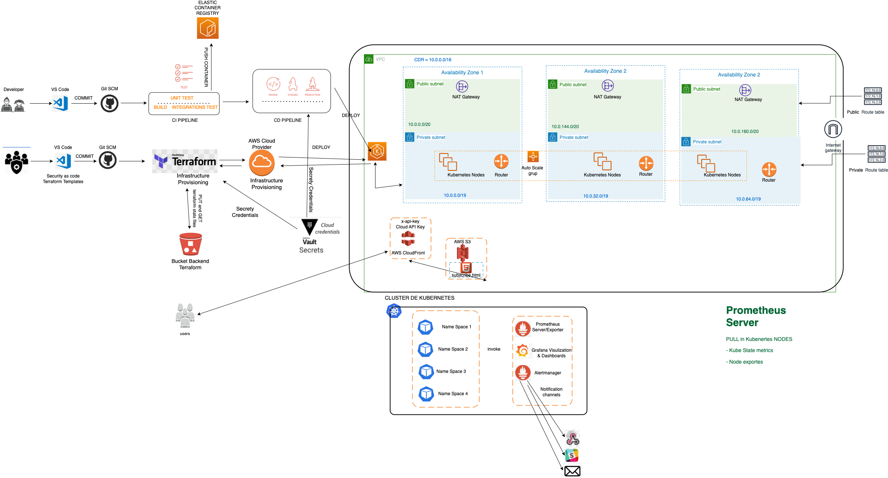

# devops-challenge-hotmart

# AWS EKS Architecture


**Note** - A arquitetura acima não reflete todos os componentes criados por este modelo. No entanto, dá uma ideia sobre a infraestrutura central que será criada. 

- Cria uma nova VPC com bloco CIDR - 10.15.0.0/19 (ou seja, 8190 IPs em uma VPC) em uma região de sua escolha. Sinta-se à vontade para alterá-lo, os valores são `dev.tfvars`.
- Cria 3 sub-redes públicas e 3 privadas com cada tamanho de 1024 endereços IP em cada zona
- Cria grupos de segurança necessários para nós do cluster e do trabalhador.
- Cria o serviço do IAM recomendado e as funções do EC2 necessárias para o cluster EKS.
- Cria Internet & NAT Gateway necessário para comunicações públicas e privadas.
- Tabela de roteamento e rotas para sub-redes públicas e privadas.


### Antes que você comece
Antes de executar este modelo, certifique-se de que as dependências a seguir sejam atendidas.

- [Install terraform](https://learn.hashicorp.com/tutorials/terraform/install-cli) - Escolha a ultima versão de acordo com o seu sistema operacional
- [Configure AWS CLI](https://docs.aws.amazon.com/cli/latest/userguide/install-linux-al2017.html) - certifique-se de configurar a AWS CLI com privilégios de administrador


### Setup do projeto
```
$ cd devops-challenge-hotmart/
```

#### Initialize Terraform
```
$ terraform init
```

#### Terraform Plan
O comando terraform plan é usado para criar um plano de execução. Sempre é uma boa prática executá-lo antes de aplicá-lo para ver o que todos os recursos serão criados.

Isso solicitará que você especifique o `nome do cluster` e o tipo de instância do nó do trabalhador.

```
$ terraform plan

var.cluster-name
  Enter eks cluster name - example like eks-demo, eks-dev etc

  Enter a value: eks-demo

var.region
  Enter region you want to create EKS cluster in

  Enter a value: us-east-1

var.ssh_key_pair
  Enter SSH keypair name that already exist in the account

  Enter a value: eks-keypair

var.worker-node-instance_type
  enter worker node instance type

  Enter a value: t2.medium

```

#### Apply changes
```
$ terraform apply
```

#### Configure kubectl
```
$ aws eks --region <AWS-REGION> update-kubeconfig --name <CLUSTER-NAME>
```
**Note:-** Se a AWS CLI e o autenticador iam da AWS forem configurados corretamente, o comando acima deve configurar o arquivo kubeconfig em ~/.kube/config em seu sistema.

#### Verify EKS cluster
```
$ kubectl get svc
```

**Output:**
```
NAME             TYPE        CLUSTER-IP   EXTERNAL-IP   PORT(S)   AGE
svc/kubernetes   ClusterIP   10.100.0.1   <none>        443/TCP   1m
```

Depois que o cluster for verificado com sucesso, é hora de criar um configMap para incluir os nós do trabalhador no cluster. Configuramos o `output` com este modelo que produzirá o conteúdo do arquivo configMap que você colar em *`aws-auth.yaml`*.

#### Add worker node
```
$ kubectl apply -f aws-auth.yaml
```

#### Nodes status - watch them joining the cluster
```
$ kubectl get no -w
```
**Note:-** Você deve ver os nós ingressando no cluster em menos de minutos.

---

## Contribution
We are happy to accept the changes that you think can help the utilities grow.

Here are some things to note:

* Raise a ticket for any requirement
* Discuss the implementation requirement or bug fix with the team members
* Fork the repository and solve the issue in one single commit
* Raise a PR regarding the same issue and attach the required documentation or provide a more detailed overview of the changes